# Using Machine Learning in Finance for Credit Risk
Mike Crabtree  
February 4, 2017  


# Introduction

This document is currently a massive WIP based on the script.

To lend or not to lend, that is the question.  Commercial banks all over the world have to make the decision to lend money to individuals.  There is some risk involved with this because not everyone they lend money to will pay back what they owe.  As an exercise, this project will classify individuals as being likely to pay back the money or default given past financial information about the individual. 

# Preparing the Workspace

Load up the required R packages and data for this project.


```r
library(gmodels)
library(rpart)
library(rpart.plot)
library(pROC)

loan_data <- readRDS(file="./data/loan_data.rds")
str(loan_data)
```

```
## 'data.frame':	29092 obs. of  8 variables:
##  $ loan_status   : int  0 0 0 0 0 0 1 0 1 0 ...
##  $ loan_amnt     : int  5000 2400 10000 5000 3000 12000 9000 3000 10000 1000 ...
##  $ int_rate      : num  10.6 NA 13.5 NA NA ...
##  $ grade         : Factor w/ 7 levels "A","B","C","D",..: 2 3 3 1 5 2 3 2 2 4 ...
##  $ emp_length    : int  10 25 13 3 9 11 0 3 3 0 ...
##  $ home_ownership: Factor w/ 4 levels "MORTGAGE","OTHER",..: 4 4 4 4 4 3 4 4 4 4 ...
##  $ annual_inc    : num  24000 12252 49200 36000 48000 ...
##  $ age           : int  33 31 24 39 24 28 22 22 28 22 ...
```

# Data Exploration

Now that the dataset is loaded, explore its contents to get familiar with the data.


```r
#Look at the number of defaults, non-defaults, and their proportions
  #There data contains 11% defaults
CrossTable(loan_data$loan_status)
```

```
## 
##  
##    Cell Contents
## |-------------------------|
## |                       N |
## |         N / Table Total |
## |-------------------------|
## 
##  
## Total Observations in Table:  29092 
## 
##  
##           |         0 |         1 | 
##           |-----------|-----------|
##           |     25865 |      3227 | 
##           |     0.889 |     0.111 | 
##           |-----------|-----------|
## 
## 
## 
## 
```

```r
#Use crosstable to look at the number/proportion of defaults and non defaults
  #for each grade
CrossTable(loan_data$grade,
           loan_data$loan_status,
           prop.r = TRUE,
           prop.c=FALSE,
           prop.t = FALSE,
           prop.chisq = FALSE)
```

```
## 
##  
##    Cell Contents
## |-------------------------|
## |                       N |
## |           N / Row Total |
## |-------------------------|
## 
##  
## Total Observations in Table:  29092 
## 
##  
##                 | loan_data$loan_status 
## loan_data$grade |         0 |         1 | Row Total | 
## ----------------|-----------|-----------|-----------|
##               A |      9084 |       565 |      9649 | 
##                 |     0.941 |     0.059 |     0.332 | 
## ----------------|-----------|-----------|-----------|
##               B |      8344 |       985 |      9329 | 
##                 |     0.894 |     0.106 |     0.321 | 
## ----------------|-----------|-----------|-----------|
##               C |      4904 |       844 |      5748 | 
##                 |     0.853 |     0.147 |     0.198 | 
## ----------------|-----------|-----------|-----------|
##               D |      2651 |       580 |      3231 | 
##                 |     0.820 |     0.180 |     0.111 | 
## ----------------|-----------|-----------|-----------|
##               E |       692 |       176 |       868 | 
##                 |     0.797 |     0.203 |     0.030 | 
## ----------------|-----------|-----------|-----------|
##               F |       155 |        56 |       211 | 
##                 |     0.735 |     0.265 |     0.007 | 
## ----------------|-----------|-----------|-----------|
##               G |        35 |        21 |        56 | 
##                 |     0.625 |     0.375 |     0.002 | 
## ----------------|-----------|-----------|-----------|
##    Column Total |     25865 |      3227 |     29092 | 
## ----------------|-----------|-----------|-----------|
## 
## 
```

```r
#The proportion of defaults increases when the credit rating moves from A to G
```


```r
#Create histogram of loan_amnt: hist_1
  #Most of the loan amounts are under 15k
hist_1 <- hist(loan_data$loan_amnt)
```

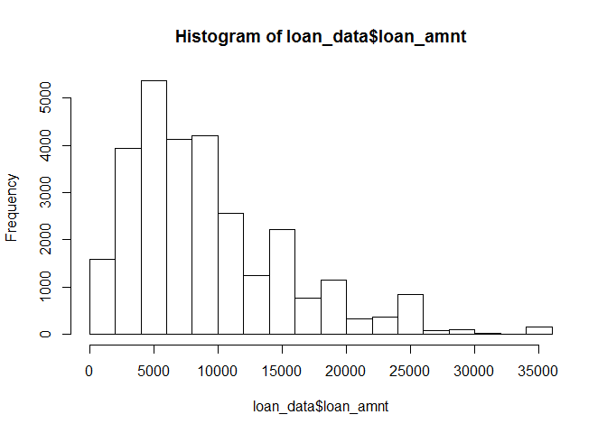<!-- -->

```r
#Print locations of the breaks in hist_1
hist_1$breaks
```

```
##  [1]     0  2000  4000  6000  8000 10000 12000 14000 16000 18000 20000
## [12] 22000 24000 26000 28000 30000 32000 34000 36000
```

```r
#Change number of breaks to 200 and add labels: hist_2
hist_2 <- hist(loan_data$loan_amnt,
               breaks = 200,
               xlab = "Loan Amount", 
               main = "Histogram of the loan amount")
```

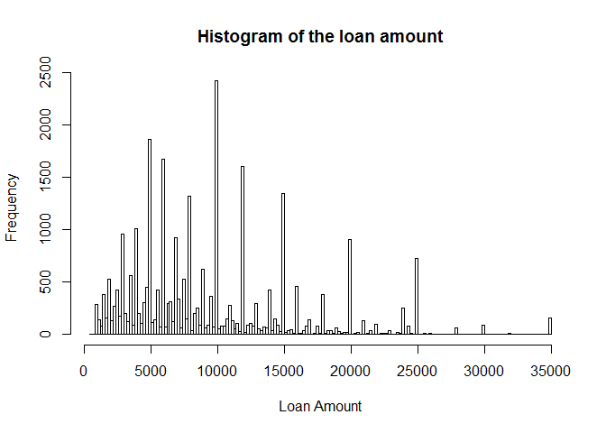<!-- -->

```r
hist_2
```

```
## $breaks
##   [1]   400   600   800  1000  1200  1400  1600  1800  2000  2200  2400
##  [12]  2600  2800  3000  3200  3400  3600  3800  4000  4200  4400  4600
##  [23]  4800  5000  5200  5400  5600  5800  6000  6200  6400  6600  6800
##  [34]  7000  7200  7400  7600  7800  8000  8200  8400  8600  8800  9000
##  [45]  9200  9400  9600  9800 10000 10200 10400 10600 10800 11000 11200
##  [56] 11400 11600 11800 12000 12200 12400 12600 12800 13000 13200 13400
##  [67] 13600 13800 14000 14200 14400 14600 14800 15000 15200 15400 15600
##  [78] 15800 16000 16200 16400 16600 16800 17000 17200 17400 17600 17800
##  [89] 18000 18200 18400 18600 18800 19000 19200 19400 19600 19800 20000
## [100] 20200 20400 20600 20800 21000 21200 21400 21600 21800 22000 22200
## [111] 22400 22600 22800 23000 23200 23400 23600 23800 24000 24200 24400
## [122] 24600 24800 25000 25200 25400 25600 25800 26000 26200 26400 26600
## [133] 26800 27000 27200 27400 27600 27800 28000 28200 28400 28600 28800
## [144] 29000 29200 29400 29600 29800 30000 30200 30400 30600 30800 31000
## [155] 31200 31400 31600 31800 32000 32200 32400 32600 32800 33000 33200
## [166] 33400 33600 33800 34000 34200 34400 34600 34800 35000
## 
## $counts
##   [1]    5    4  285  137   84  384  159  530  129  272  422  171  960  200
##  [15]  123  564   90 1011  205  107  303  448 1859  116  143  424   76 1677
##  [29]   73  298  312  122  923  337   64  525  147 1324   39  199  252   90
##  [43]  625   61   86  366   75 2419   57   80   81  153  275  128   51  109
##  [57]   29 1604   24   86  104   82  293   53   37   76   62  422   34  150
##  [71]   88   28 1347   23   35   46   14  459    9    9   34   79  141    7
##  [85]   15   80    9  385   14   39   34    9   62   30    8   20   22  910
##  [99]    5   12   18    6  131    6   13   35    3   95    3   14   10   15
## [113]   35    5    3   21    8  253    5   83    8    6  725    1    1   10
## [127]    0    9    0    2    0    1    5    4    3    5    0   62    0    1
## [141]    0    1    3    3    0    1    4   92    0    0    1    1    2    1
## [155]    2    0    0   11    0    1    1    0    5    0    1    0    0    6
## [169]    0    0    0    1  162
## 
## $density
##   [1] 8.593428e-07 6.874742e-07 4.898254e-05 2.354599e-05 1.443696e-05
##   [6] 6.599753e-05 2.732710e-05 9.109033e-05 2.217104e-05 4.674825e-05
##  [11] 7.252853e-05 2.938952e-05 1.649938e-04 3.437371e-05 2.113983e-05
##  [16] 9.693386e-05 1.546817e-05 1.737591e-04 3.523305e-05 1.838994e-05
##  [21] 5.207617e-05 7.699711e-05 3.195036e-04 1.993675e-05 2.457720e-05
##  [26] 7.287227e-05 1.306201e-05 2.882236e-04 1.254640e-05 5.121683e-05
##  [31] 5.362299e-05 2.096796e-05 1.586347e-04 5.791970e-05 1.099959e-05
##  [36] 9.023099e-05 2.526468e-05 2.275540e-04 6.702874e-06 3.420184e-05
##  [41] 4.331088e-05 1.546817e-05 1.074178e-04 1.048398e-05 1.478070e-05
##  [46] 6.290389e-05 1.289014e-05 4.157500e-04 9.796508e-06 1.374948e-05
##  [51] 1.392135e-05 2.629589e-05 4.726385e-05 2.199918e-05 8.765296e-06
##  [56] 1.873367e-05 4.984188e-06 2.756772e-04 4.124845e-06 1.478070e-05
##  [61] 1.787433e-05 1.409322e-05 5.035749e-05 9.109033e-06 6.359137e-06
##  [66] 1.306201e-05 1.065585e-05 7.252853e-05 5.843531e-06 2.578028e-05
##  [71] 1.512443e-05 4.812320e-06 2.315069e-04 3.952977e-06 6.015399e-06
##  [76] 7.905954e-06 2.406160e-06 7.888767e-05 1.546817e-06 1.546817e-06
##  [81] 5.843531e-06 1.357762e-05 2.423347e-05 1.203080e-06 2.578028e-06
##  [86] 1.374948e-05 1.546817e-06 6.616939e-05 2.406160e-06 6.702874e-06
##  [91] 5.843531e-06 1.546817e-06 1.065585e-05 5.156057e-06 1.374948e-06
##  [96] 3.437371e-06 3.781108e-06 1.564004e-04 8.593428e-07 2.062423e-06
## [101] 3.093634e-06 1.031211e-06 2.251478e-05 1.031211e-06 2.234291e-06
## [106] 6.015399e-06 5.156057e-07 1.632751e-05 5.156057e-07 2.406160e-06
## [111] 1.718686e-06 2.578028e-06 6.015399e-06 8.593428e-07 5.156057e-07
## [116] 3.609240e-06 1.374948e-06 4.348274e-05 8.593428e-07 1.426509e-05
## [121] 1.374948e-06 1.031211e-06 1.246047e-04 1.718686e-07 1.718686e-07
## [126] 1.718686e-06 0.000000e+00 1.546817e-06 0.000000e+00 3.437371e-07
## [131] 0.000000e+00 1.718686e-07 8.593428e-07 6.874742e-07 5.156057e-07
## [136] 8.593428e-07 0.000000e+00 1.065585e-05 0.000000e+00 1.718686e-07
## [141] 0.000000e+00 1.718686e-07 5.156057e-07 5.156057e-07 0.000000e+00
## [146] 1.718686e-07 6.874742e-07 1.581191e-05 0.000000e+00 0.000000e+00
## [151] 1.718686e-07 1.718686e-07 3.437371e-07 1.718686e-07 3.437371e-07
## [156] 0.000000e+00 0.000000e+00 1.890554e-06 0.000000e+00 1.718686e-07
## [161] 1.718686e-07 0.000000e+00 8.593428e-07 0.000000e+00 1.718686e-07
## [166] 0.000000e+00 0.000000e+00 1.031211e-06 0.000000e+00 0.000000e+00
## [171] 0.000000e+00 1.718686e-07 2.784271e-05
## 
## $mids
##   [1]   500   700   900  1100  1300  1500  1700  1900  2100  2300  2500
##  [12]  2700  2900  3100  3300  3500  3700  3900  4100  4300  4500  4700
##  [23]  4900  5100  5300  5500  5700  5900  6100  6300  6500  6700  6900
##  [34]  7100  7300  7500  7700  7900  8100  8300  8500  8700  8900  9100
##  [45]  9300  9500  9700  9900 10100 10300 10500 10700 10900 11100 11300
##  [56] 11500 11700 11900 12100 12300 12500 12700 12900 13100 13300 13500
##  [67] 13700 13900 14100 14300 14500 14700 14900 15100 15300 15500 15700
##  [78] 15900 16100 16300 16500 16700 16900 17100 17300 17500 17700 17900
##  [89] 18100 18300 18500 18700 18900 19100 19300 19500 19700 19900 20100
## [100] 20300 20500 20700 20900 21100 21300 21500 21700 21900 22100 22300
## [111] 22500 22700 22900 23100 23300 23500 23700 23900 24100 24300 24500
## [122] 24700 24900 25100 25300 25500 25700 25900 26100 26300 26500 26700
## [133] 26900 27100 27300 27500 27700 27900 28100 28300 28500 28700 28900
## [144] 29100 29300 29500 29700 29900 30100 30300 30500 30700 30900 31100
## [155] 31300 31500 31700 31900 32100 32300 32500 32700 32900 33100 33300
## [166] 33500 33700 33900 34100 34300 34500 34700 34900
## 
## $xname
## [1] "loan_data$loan_amnt"
## 
## $equidist
## [1] TRUE
## 
## attr(,"class")
## [1] "histogram"
```


```r
#Plot the age variable
  #Someone has an age of over 120, which is incredibly unlikely
plot(loan_data$age, ylab="Age")
```

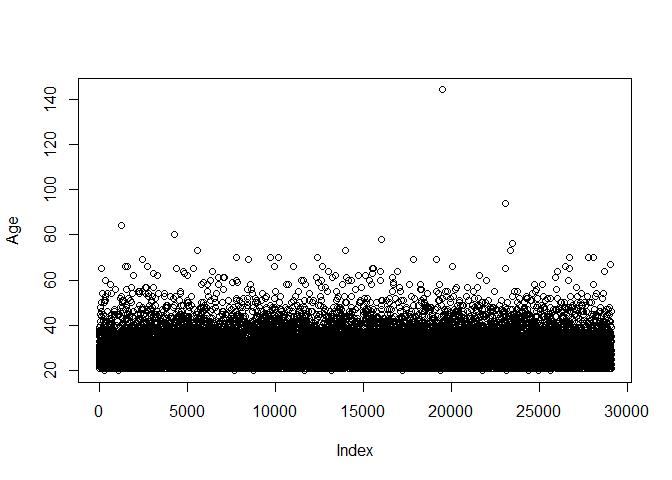<!-- -->

## Remove Outliers and Continue Exploring


```r
#Save the outlier's index to index_highage
index_highage <- which(loan_data$age>122)

#Remove the outlier
loan_data <- loan_data[-index_highage, ]

#Make bivariate scatterplot of age and annual income
plot(loan_data$age,
     loan_data$annual_inc,
     xlab = "Age",
     ylab = "Annual Income")
```

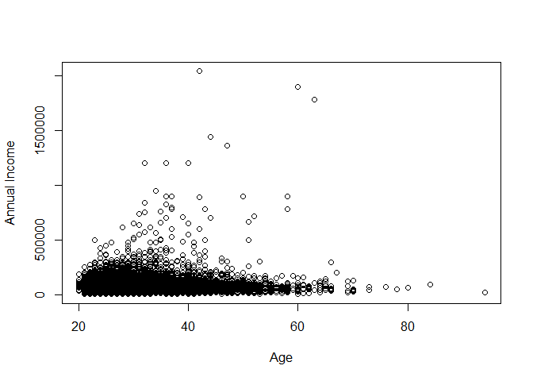<!-- -->


```r
#Look at summary of the interest rates for the data
summary(loan_data$int_rate)
```

```
##    Min. 1st Qu.  Median    Mean 3rd Qu.    Max.    NA's 
##    5.42    7.90   10.99   11.00   13.47   23.22    2776
```

```r
#Get indices of missing interest rates: na_index
na_index <- which(is.na(loan_data$int_rate))

#Compute the median of int_rate
median_ir <- median(loan_data$int_rate, na.rm=TRUE)

#Replace missing interest rates with median
loan_data$int_rate[na_index] <- median_ir

#Check if the NAs are gone
summary(loan_data$int_rate)
```

```
##    Min. 1st Qu.  Median    Mean 3rd Qu.    Max. 
##    5.42    8.49   10.99   11.00   13.11   23.22
```

# Feature Engineering

There is some more useful information contained within the data, but it is easier to work with if some of the continuous numeric features are made into categorical (for purposes of classification).

## Engineer a New Feature - Interest Rate Category


```r
#Engineer a new feature vector for interest rate categories/buckets
loan_data$ir_cat <- rep(NA, length(loan_data$int_rate))

loan_data$ir_cat[which(loan_data$int_rate <= 8)] <- "0-8"
loan_data$ir_cat[which(loan_data$int_rate > 8 & loan_data$int_rate <= 11)] <- "8-11"
loan_data$ir_cat[which(loan_data$int_rate > 11 & loan_data$int_rate <= 13.5)] <- "11-13.5"
loan_data$ir_cat[which(loan_data$int_rate > 13.5)] <- "13.5+"
loan_data$ir_cat[which(is.na(loan_data$int_rate))] <- "Missing"

loan_data$ir_cat <- as.factor(loan_data$ir_cat)
```

Now that I have created a new feature to store the categorization of the interest rate, explore that feature a little more.


```r
#Look at the bins and their distribution
plot(loan_data$ir_cat)
```

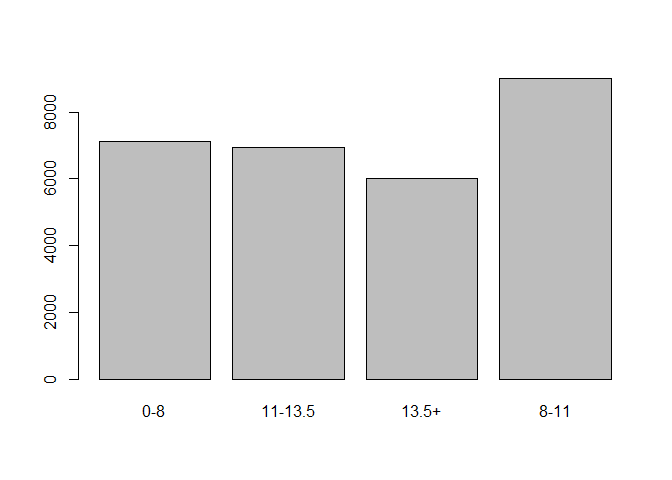<!-- -->

```r
#Look at the different categories in ir_cat using table()
table(loan_data$ir_cat)
```

```
## 
##     0-8 11-13.5   13.5+    8-11 
##    7130    6953    6002    9006
```

## Engineer a New Feature - Employment Category


```r
#Engineer a new feature vector for employment length categories/buckets

loan_data$emp_cat <- rep(NA, length(loan_data$emp_length))
loan_data$emp_cat[which(loan_data$emp_length >= 0 & loan_data$emp_length <= 15)] <- "0-15"
loan_data$emp_cat[which(loan_data$emp_length > 15 & loan_data$emp_length <= 30)] <- "15-30"
loan_data$emp_cat[which(loan_data$emp_length > 30 & loan_data$emp_length <= 45)] <- "30-45"
loan_data$emp_cat[which(loan_data$emp_length > 45)] <- "45+"
loan_data$emp_cat[which(is.na(loan_data$emp_length))] <- "Missing"

loan_data$emp_cat <- as.factor(loan_data$emp_cat)
```

Now that I have engineered the new employment category feature, look at the distribution of categories in a table.


```r
table(loan_data$emp_cat)
```

```
## 
##    0-15   15-30   30-45     45+ Missing 
##   25642    2345     263      32     809
```

# Modeling - Logistic Regression

Here I begin to prepare the data for modeling.

## Multivariate Logistic Regression


```r
#Set a seed for reproducibility
set.seed(567)

#Store row numbers for training set: index_train
index_train <- sample(1:nrow(loan_data), (2/3)*(nrow(loan_data)))

#Create training set: training_set
training_set <- loan_data[index_train, ]

#Create test set: test_set
test_set <- loan_data[-index_train,]

#Build the logistic regression model
log_model_multi <- glm(loan_status ~ age + ir_cat+ grade+ loan_amnt+ annual_inc+ emp_cat,
                       data=training_set,
                       family="binomial")

#Obtain significance levels using summary()
summary(log_model_multi)
```

```
## 
## Call:
## glm(formula = loan_status ~ age + ir_cat + grade + loan_amnt + 
##     annual_inc + emp_cat, family = "binomial", data = training_set)
## 
## Deviance Residuals: 
##     Min       1Q   Median       3Q      Max  
## -1.1869  -0.5400  -0.4396  -0.3356   3.1748  
## 
## Coefficients:
##                  Estimate Std. Error z value Pr(>|z|)    
## (Intercept)    -2.384e+00  1.275e-01 -18.697  < 2e-16 ***
## age            -7.471e-03  3.881e-03  -1.925 0.054228 .  
## ir_cat11-13.5   6.417e-01  1.306e-01   4.911 9.04e-07 ***
## ir_cat13.5+     5.541e-01  1.437e-01   3.855 0.000116 ***
## ir_cat8-11      3.910e-01  1.102e-01   3.547 0.000390 ***
## gradeB          2.188e-01  1.046e-01   2.092 0.036476 *  
## gradeC          5.343e-01  1.190e-01   4.490 7.11e-06 ***
## gradeD          8.862e-01  1.342e-01   6.604 4.00e-11 ***
## gradeE          1.010e+00  1.628e-01   6.207 5.41e-10 ***
## gradeF          1.422e+00  2.233e-01   6.369 1.91e-10 ***
## gradeG          1.997e+00  3.352e-01   5.959 2.54e-09 ***
## loan_amnt      -3.218e-06  4.103e-06  -0.784 0.432928    
## annual_inc     -4.538e-06  7.241e-07  -6.267 3.67e-10 ***
## emp_cat15-30    1.172e-01  8.632e-02   1.357 0.174640    
## emp_cat30-45    1.034e-01  2.604e-01   0.397 0.691397    
## emp_cat45+      7.150e-01  5.635e-01   1.269 0.204480    
## emp_catMissing  7.690e-01  1.138e-01   6.760 1.38e-11 ***
## ---
## Signif. codes:  0 '***' 0.001 '**' 0.01 '*' 0.05 '.' 0.1 ' ' 1
## 
## (Dispersion parameter for binomial family taken to be 1)
## 
##     Null deviance: 13676  on 19393  degrees of freedom
## Residual deviance: 13092  on 19377  degrees of freedom
## AIC: 13126
## 
## Number of Fisher Scoring iterations: 5
```


```r
#Look at the predictions range
predictions_multi <- predict(log_model_multi,
                                 newdata = test_set,
                                 type = "response")

range(predictions_multi)
```

```
## [1] 2.027918e-05 5.119586e-01
```


```r
#Make a binary predictions-vector using a cut-off of 15% and 20%
pred_cutoff_15 <- ifelse(predictions_multi > 0.15, 1, 0)
pred_cutoff_20 <- ifelse(predictions_multi > 0.20, 1, 0)

#Check the cutoff with a confusion matrix
table(test_set$loan_status, pred_cutoff_15)
```

```
##    pred_cutoff_15
##        0    1
##   0 6732 1928
##   1  636  401
```

```r
table(test_set$loan_status, pred_cutoff_20)
```

```
##    pred_cutoff_20
##        0    1
##   0 8100  560
##   1  876  161
```

```r
#Accuracy and specificity increase, but sensitivity decreases
```

## Multiple Logistic Models

The performance for the logistic regression above was okay, but what about other models.


```r
#Check out the logit, probit and cloglog logistic regression models
log_model_logit <- glm(loan_status ~ age + emp_cat + ir_cat + loan_amnt,
                       family = binomial(link = logit),
                       data = training_set)

log_model_probit <- glm(loan_status ~ age + emp_cat + ir_cat + loan_amnt,
                        family = binomial(link = probit),
                        data = training_set)

log_model_cloglog <-glm(loan_status ~ age + emp_cat + ir_cat + loan_amnt,
                        family = binomial(link = cloglog),
                        data = training_set)  

log_model_all_full <- glm(loan_status ~ loan_amnt + int_rate + grade + emp_length 
                          + home_ownership + annual_inc + age + ir_cat,
                          family = binomial(link = logit),
                          data = training_set)
```


```r
#Make predictions for all models using the test set
predictions_logit <- predict(log_model_logit,
                             newdata = test_set,
                             type = "response")
predictions_probit <- predict(log_model_probit,
                              newdata = test_set,
                              type = "response")
predictions_cloglog <- predict(log_model_cloglog,
                               newdata = test_set,
                               type = "response")
predictions_all_full <- predict(log_model_all_full,
                               newdata = test_set,
                               type = "response")
```


```r
#Using a cut-off of 14% to make binary predictions-vectors
cutoff <- 0.14
class_pred_logit <- ifelse(predictions_logit > cutoff, 1, 0)
class_pred_probit <- ifelse(predictions_probit > cutoff, 1, 0)
class_pred_cloglog <- ifelse(predictions_cloglog > cutoff, 1, 0)

#Creating a vector to store the actual loan default status values
true_val <- test_set$loan_status
```


```r
#Make a confusion matrix for the three models
tab_class_logit <- table(true_val,class_pred_logit)
tab_class_probit <- table(true_val,class_pred_probit)
tab_class_cloglog <- table(true_val,class_pred_cloglog)

#Check out the matrices
tab_class_logit
```

```
##         class_pred_logit
## true_val    0    1
##        0 6362 2298
##        1  590  447
```

```r
tab_class_probit
```

```
##         class_pred_probit
## true_val    0    1
##        0 6356 2304
##        1  590  447
```

```r
tab_class_cloglog
```

```
##         class_pred_cloglog
## true_val    0    1
##        0 6375 2285
##        1  591  446
```


```r
#Compute the classification accuracy for all three models
acc_logit <- sum(diag(tab_class_logit)) / nrow(test_set)
acc_probit <- sum(diag(tab_class_probit)) / nrow(test_set)
acc_cloglog <- sum(diag(tab_class_cloglog)) / nrow(test_set)

#Check out each accuracy
acc_logit
```

```
## [1] 0.7021759
```

```r
acc_probit
```

```
## [1] 0.7015572
```

```r
acc_cloglog
```

```
## [1] 0.7034134
```

```r
#They're all about 70%
```


# Modeling - Decision Trees

## Undersampling

So the performance for all of the models is not great.  This is because it is difficult for the models above to work with the data.  There are so few examples of those who default on loans, that the models are having difficulty classifying out of sample examples properly.  To rememdy this, I try undersampling and adjusting the cost matrix to penalize models for defaults more.


```r
#Create an undersampled training set with 2/3 non-defaults and 1/3 defaults
defaults <- loan_data[loan_data$loan_status==1,]
nondefaults <- loan_data[loan_data$loan_status==0,]

part1 <- nondefaults[sample(nrow(nondefaults), 4380,
                        replace = FALSE,
                        prob = NULL),]

part2 <- defaults[sample(nrow(defaults), 2190,
                            replace = FALSE,
                            prob = NULL),]

undersampled_training_set <- rbind(part1,part2)
table(undersampled_training_set$loan_status)
```

```
## 
##    0    1 
## 4380 2190
```

## Decision Tree on Undersampled Set


```r
#Change the code provided in the video such that a decision tree is constructed using the undersampled training set. Include rpart.control to relax the complexity parameter to 0.001.
tree_undersample <- rpart(loan_status ~ .,
                          method = "class",
                          data =  undersampled_training_set,
                          control = rpart.control(cp=0.001))

#Plot the decision tree
plot(tree_undersample,
     uniform = TRUE)

#Add labels to the decision tree
text(tree_undersample)
```

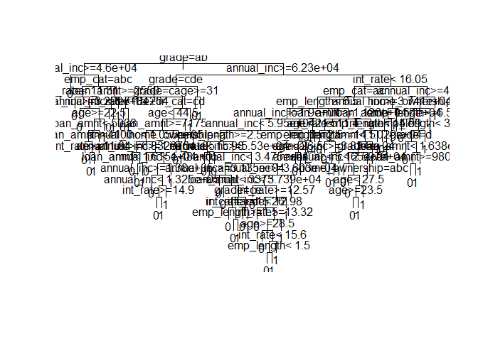<!-- -->


```r
#Plot the cross-validated error rate as a function of the complexity parameter
plotcp(tree_undersample)
```

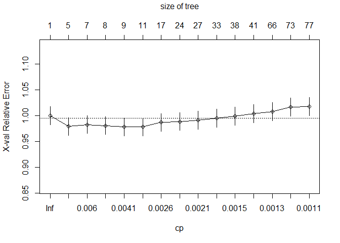<!-- -->

```r
#Use printcp() to identify for which complexity parameter the cross-validated error rate is minimized.
printcp(tree_undersample)
```

```
## 
## Classification tree:
## rpart(formula = loan_status ~ ., data = undersampled_training_set, 
##     method = "class", control = rpart.control(cp = 0.001))
## 
## Variables actually used in tree construction:
## [1] age            annual_inc     emp_cat        emp_length    
## [5] grade          home_ownership int_rate       ir_cat        
## [9] loan_amnt     
## 
## Root node error: 2190/6570 = 0.33333
## 
## n= 6570 
## 
##           CP nsplit rel error  xerror     xstd
## 1  0.0086758      0   1.00000 1.00000 0.017447
## 2  0.0061644      4   0.96119 0.97900 0.017354
## 3  0.0059361      6   0.94886 0.98265 0.017370
## 4  0.0050228      7   0.94292 0.98082 0.017362
## 5  0.0034247      8   0.93790 0.97808 0.017349
## 6  0.0030441     10   0.93105 0.97808 0.017349
## 7  0.0022831     16   0.91279 0.98676 0.017389
## 8  0.0021309     23   0.89680 0.98858 0.017397
## 9  0.0020548     26   0.89041 0.99132 0.017409
## 10 0.0015525     32   0.87808 0.99498 0.017425
## 11 0.0015221     37   0.87032 0.99909 0.017443
## 12 0.0013699     40   0.86575 1.00365 0.017463
## 13 0.0012177     65   0.82146 1.00776 0.017481
## 14 0.0011416     72   0.81096 1.01689 0.017520
## 15 0.0010000     76   0.80639 1.01781 0.017524
```


```r
#Create an index for of the row with the minimum xerror
index <- which.min(tree_undersample$cptable[ , "xerror"])

#Create tree_min
tree_min <- tree_undersample$cptable[index, "CP"]

#Prune the tree using tree_min
ptree_undersample <- prune(tree_undersample, cp = tree_min)

#Use prp() to plot the pruned tree
prp(ptree_undersample)
```

<!-- -->


```r
#Construct a tree with adjusted prior probabilities.
tree_prior <- rpart(loan_status ~ .,
                    method = "class",
                    data = training_set,
                    control = rpart.control(cp=0.001),
                    parms = list(prior=c(0.7,0.3)))

#Plot the decision tree
plot(tree_prior,uniform=TRUE)

#Add labels to the decision tree
text(tree_prior)
```

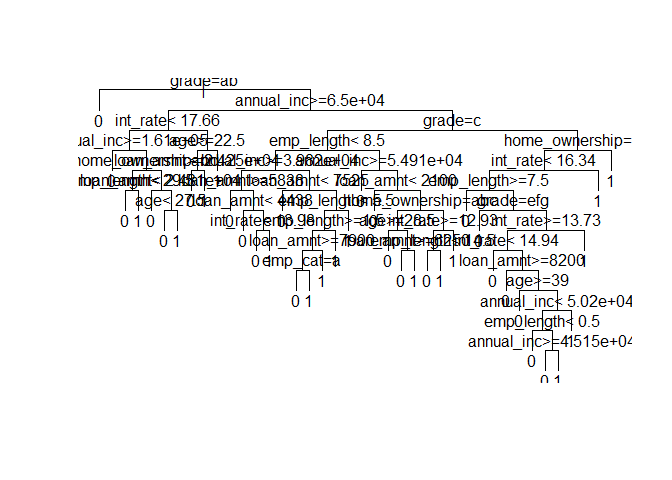<!-- -->

## Cost Matrix

## Decision Tree with Adjusted Cost Matrix


```r
#Try changing the cost matrix to penalize defaults as non-defaults more heavily
tree_loss_matrix <- rpart(loan_status ~ .,
                          method = "class",
                          data =  training_set,
                          control = rpart.control(cp = 0.001),
                          parms = list(loss=matrix(c(0,10,1,0),ncol=2)))


#Plot the decision tree
plot(tree_loss_matrix,
     uniform = TRUE)

#Add labels to the decision tree
text(tree_loss_matrix)
```

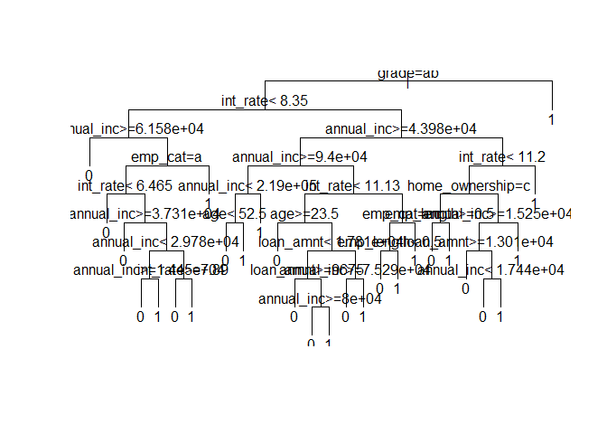<!-- -->


```r
#Plot the cross-validated error rate as a function of the complexity parameter
plotcp(tree_prior)
```

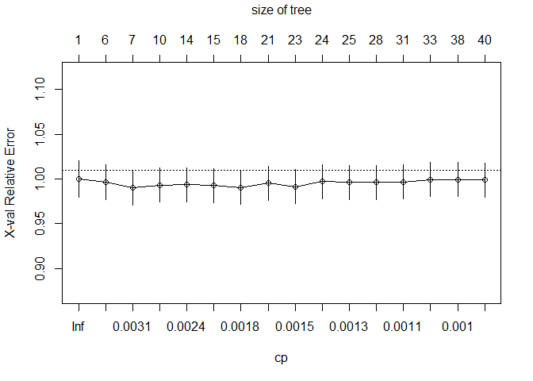<!-- -->

```r
#Use printcp() to identify for which complexity parameter the cross-validated error rate is minimized.
printcp(tree_prior)
```

```
## 
## Classification tree:
## rpart(formula = loan_status ~ ., data = training_set, method = "class", 
##     parms = list(prior = c(0.7, 0.3)), control = rpart.control(cp = 0.001))
## 
## Variables actually used in tree construction:
## [1] age            annual_inc     emp_cat        emp_length    
## [5] grade          home_ownership int_rate       loan_amnt     
## 
## Root node error: 5818.2/19394 = 0.3
## 
## n= 19394 
## 
##           CP nsplit rel error  xerror     xstd
## 1  0.0046850      0   1.00000 1.00000 0.020126
## 2  0.0034092      5   0.97501 0.99671 0.019506
## 3  0.0028543      6   0.97160 0.99040 0.019247
## 4  0.0026620      9   0.96303 0.99326 0.019073
## 5  0.0021564     13   0.95239 0.99351 0.019020
## 6  0.0018742     14   0.95023 0.99248 0.019023
## 7  0.0016952     17   0.94458 0.99064 0.019037
## 8  0.0015778     20   0.93945 0.99515 0.019064
## 9  0.0013337     22   0.93630 0.99152 0.019010
## 10 0.0012658     23   0.93496 0.99727 0.019062
## 11 0.0012433     24   0.93370 0.99637 0.019065
## 12 0.0011641     27   0.92997 0.99632 0.019061
## 13 0.0010714     30   0.92557 0.99666 0.019046
## 14 0.0010525     32   0.92343 0.99922 0.018994
## 15 0.0010398     37   0.91816 0.99926 0.018986
## 16 0.0010000     39   0.91608 0.99893 0.018982
```


```r
#Create an index for of the row with the minimum xerror
index <- which.min(tree_prior$cptable[ , "xerror"])

#Create tree_min
tree_min <- tree_prior$cptable[index, "CP"]

#Prune the tree using tree_min
ptree_prior <- prune(tree_prior, cp = tree_min)

#Use prp() to plot the pruned tree
prp(ptree_prior)
```

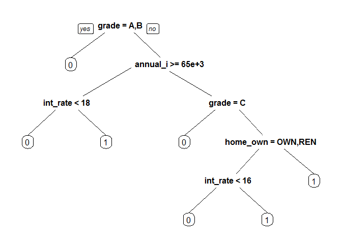<!-- -->


```r
#set a seed and run the code to construct the tree with the loss matrix again
set.seed(345)
tree_loss_matrix  <- rpart(loan_status ~ .,
                           method = "class", 
                           data = training_set,
                           parms = list(loss=matrix(c(0, 10, 1, 0), ncol = 2)),
                           control = rpart.control(cp = 0.001))

#Plot the cross-validated error rate as a function of the complexity parameter
plotcp(tree_loss_matrix)
```

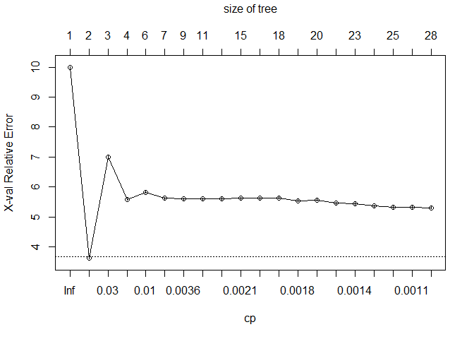<!-- -->


```r
#Prune the tree using cp = 0.0012788
ptree_loss_matrix <- prune(tree_loss_matrix, cp=0.0012788)

#Use prp() and argument extra = 1 to plot the pruned tree
prp(ptree_loss_matrix, extra = 1)
```

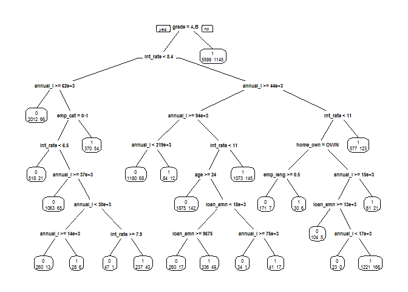<!-- -->

```r
case_weights <- ifelse(training_set$loan_status==0,1,3)
```

## Weighting

## Modeling - Decision Tree with Adjusted Weights


```r
#Make a tree while adjusting the minsplit and minbucket parameters
tree_weights <- rpart(loan_status ~ .,
                      method = "class",
                      data = training_set,
                      weights = case_weights,
                      control = rpart.control(minsplit = 5, minbucket = 2, cp = 0.001))

#Plot the cross-validated error rate for a changing cp
plotcp(tree_weights)
```

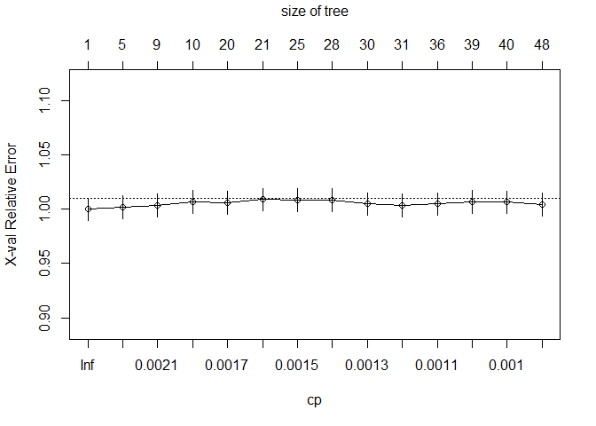<!-- -->


```r
#Create an index for of the row with the minimum xerror
index <- which.min(tree_weights$cp[ , "xerror"])

#Create tree_min
tree_min <- tree_weights$cp[index, "CP"]

#Prune the tree using tree_min
ptree_weights <- prune(tree_weights, cp =tree_min)

#Plot the pruned tree using the rpart.plot()-package
prp(ptree_weights, extra = 1)
```

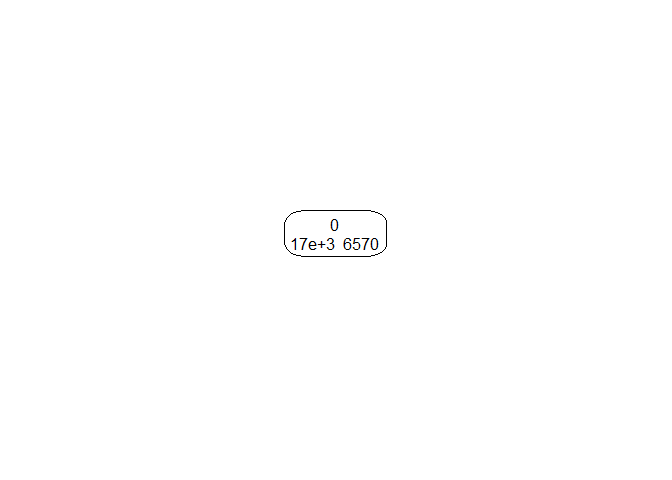<!-- -->

## Decision Tree Model Comparison


```r
#Make predictions for each of the pruned trees using the test set.
pred_undersample <- predict(ptree_undersample, newdata=test_set, type="class")
pred_prior <- predict(ptree_prior, newdata=test_set, type="class")
pred_loss_matrix <- predict(ptree_loss_matrix, newdata=test_set, type="class")
pred_weights <- predict(ptree_weights, newdata=test_set, type="class")
```


```r
#Construct confusion matrices using the predictions.
confmat_undersample <- table(test_set$loan_status,pred_undersample)
confmat_prior <- table(test_set$loan_status, pred_prior)
confmat_loss_matrix <- table(test_set$loan_status, pred_loss_matrix)
confmat_weights <- table(test_set$loan_status, pred_weights)

confmat_undersample
```

```
##    pred_undersample
##        0    1
##   0 8093  567
##   1  876  161
```

```r
confmat_prior
```

```
##    pred_prior
##        0    1
##   0 8319  341
##   1  954   83
```

```r
confmat_loss_matrix
```

```
##    pred_loss_matrix
##        0    1
##   0 3759 4901
##   1  240  797
```

```r
confmat_weights
```

```
##    pred_weights
##        0    1
##   0 8660    0
##   1 1037    0
```


```r
#Compute the accuracies
acc_undersample <- sum(diag(confmat_undersample)) / nrow(test_set)
acc_prior <- sum(diag(confmat_prior)) / nrow(test_set)
acc_loss_matrix <- sum(diag(confmat_loss_matrix)) / nrow(test_set)
acc_weights <- sum(diag(confmat_weights)) / nrow(test_set)

acc_undersample
```

```
## [1] 0.8511911
```

```r
acc_prior
```

```
## [1] 0.8664535
```

```r
acc_loss_matrix
```

```
## [1] 0.469836
```

```r
acc_weights
```

```
## [1] 0.8930597
```

# Acceptance Rate

All banks have an acceptance rate.  More notes here.


```r
#Make predictions for the probability of default using the pruned tree and the test set.
prob_default_prior <- predict(ptree_prior, newdata = test_set)[ ,2]

#Obtain the cutoff for acceptance rate 80%
cutoff_prior <- quantile(prob_default_prior, 0.8)

#Obtain the binary predictions.
bin_pred_prior_80 <- ifelse(prob_default_prior> cutoff_prior,1,0)

#Obtain the actual default status for the accepted loans
accepted_status_prior_80 <- cbind(prob_default_prior, bin_pred_prior_80)

table(test_set$loan_status[bin_pred_prior_80 == 0])
```

```
## 
##    0    1 
## 7931  868
```

```r
#Obtain the bad rate for the accepted loans
bad_rate <- sum(accepted_status_prior_80)/length(accepted_status_prior_80)
bad_rate
```

```
## [1] 0.1919774
```

# Bank Strategy with Default Probability


```r
strategy_bank <- function(prob_of_def){
  cutoff=rep(NA, 21)
  bad_rate=rep(NA, 21)
  accept_rate=seq(1,0,by=-0.05)
  for (i in 1:21){
    cutoff[i]=quantile(prob_of_def,accept_rate[i])
    pred_i=ifelse(prob_of_def> cutoff[i], 1, 0)
    pred_as_good=test_set$loan_status[pred_i==0]
    bad_rate[i]=sum(pred_as_good)/length(pred_as_good)}
  table=cbind(accept_rate,cutoff=round(cutoff,4),bad_rate=round(bad_rate,4))
  return(list(table=table,bad_rate=bad_rate, accept_rate=accept_rate, cutoff=cutoff))
}
```

## Apply the Bank Strategy


```r
#Apply the function strategy_bank to both predictions_cloglog and predictions_loss_matrix
strategy_cloglog <- strategy_bank(predictions_cloglog)

#Obtain the strategy tables for both prediction-vectors
strategy_cloglog$table
```

```
##       accept_rate cutoff bad_rate
##  [1,]        1.00 0.3677   0.1069
##  [2,]        0.95 0.1894   0.1012
##  [3,]        0.90 0.1812   0.0985
##  [4,]        0.85 0.1707   0.0944
##  [5,]        0.80 0.1539   0.0906
##  [6,]        0.75 0.1435   0.0872
##  [7,]        0.70 0.1383   0.0834
##  [8,]        0.65 0.1328   0.0803
##  [9,]        0.60 0.1255   0.0763
## [10,]        0.55 0.1105   0.0737
## [11,]        0.50 0.1013   0.0714
## [12,]        0.45 0.0981   0.0694
## [13,]        0.40 0.0953   0.0643
## [14,]        0.35 0.0922   0.0606
## [15,]        0.30 0.0880   0.0547
## [16,]        0.25 0.0800   0.0470
## [17,]        0.20 0.0571   0.0454
## [18,]        0.15 0.0549   0.0384
## [19,]        0.10 0.0529   0.0402
## [20,]        0.05 0.0501   0.0389
## [21,]        0.00 0.0306   0.0000
```

## Plot the Bank Strategy Using Logistic Regression


```r
#Plot the strategy function
par(mfrow = c(1,2))
plot(strategy_cloglog$accept_rate, strategy_cloglog$bad_rate, 
     type = "l", xlab = "Acceptance rate", ylab = "Bad rate", 
     lwd = 2, main = "logistic regression")
```

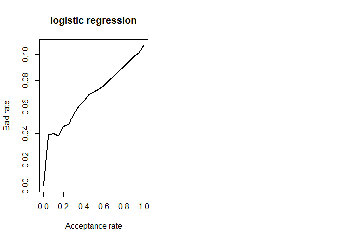<!-- -->

# ROC Curves - Logistic Regression


```r
#Construct the objects containing ROC-information
ROC_logit <- roc(test_set$loan_status, predictions_logit)
ROC_probit <- roc(test_set$loan_status, predictions_probit)
ROC_cloglog <- roc(test_set$loan_status, predictions_cloglog)
ROC_all_full <- roc(test_set$loan_status, predictions_all_full)##
```


```r
#Draw all ROCs on one plot
plot(ROC_logit)
```

```
## 
## Call:
## roc.default(response = test_set$loan_status, predictor = predictions_logit)
## 
## Data: predictions_logit in 8660 controls (test_set$loan_status 0) < 1037 cases (test_set$loan_status 1).
## Area under the curve: 0.6328
```

```r
lines(ROC_probit, col="blue")
lines(ROC_cloglog, col="red")
lines(ROC_all_full, col="green")
```

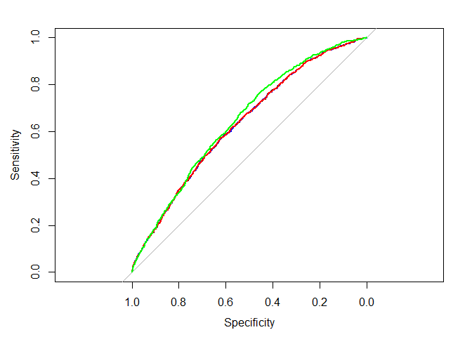<!-- -->


```r
#Compute the AUCs
auc(ROC_logit)
```

```
## Area under the curve: 0.6328
```

```r
auc(ROC_probit)
```

```
## Area under the curve: 0.6327
```

```r
auc(ROC_cloglog)
```

```
## Area under the curve: 0.6328
```

```r
auc(ROC_all_full)
```

```
## Area under the curve: 0.6465
```

# Decision Trees

## Decision Tree Predictions


```r
predictions_undersample <- predict(ptree_undersample, newdata=test_set, type="vector")
predictions_prior <- predict(ptree_prior, newdata=test_set, type="vector")
predictions_loss_matrix <- predict(ptree_loss_matrix, newdata=test_set, type="vector")
predictions_weights <- predict(ptree_weights, newdata=test_set, type="vector")
```

## Decision Tree ROC Curves


```r
#Construct the objects containing ROC-information
ROC_undersample <- roc(test_set$loan_status,predictions_undersample)
ROC_prior <- roc(test_set$loan_status,predictions_prior)
ROC_loss_matrix <- roc(test_set$loan_status,predictions_loss_matrix)
ROC_weights <- roc(test_set$loan_status,predictions_weights)
```

## Plot the ROC Curves


```r
#Draw the ROC-curves in one plot
plot(ROC_undersample)
```

```
## 
## Call:
## roc.default(response = test_set$loan_status, predictor = predictions_undersample)
## 
## Data: predictions_undersample in 8660 controls (test_set$loan_status 0) < 1037 cases (test_set$loan_status 1).
## Area under the curve: 0.5449
```

```r
lines(ROC_prior,col="blue")
lines(ROC_loss_matrix,col="red")
lines(ROC_weights,col="green")
```

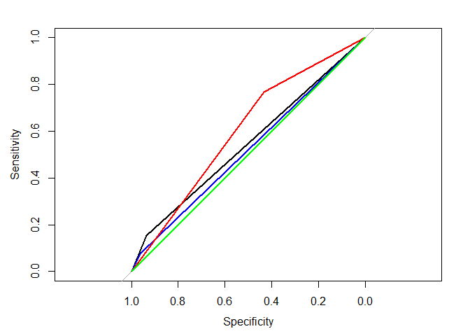<!-- -->

## Compute the AUC for Each Tree


```r
#Compute the AUCs
auc(ROC_undersample)
```

```
## Area under the curve: 0.5449
```

```r
auc(ROC_prior)
```

```
## Area under the curve: 0.5203
```

```r
auc(ROC_loss_matrix)
```

```
## Area under the curve: 0.6013
```

```r
auc(ROC_weights)
```

```
## Area under the curve: 0.5
```

# Logistic Regression - Removing Features


```r
#Build four models each time deleting one variable in log_3_remove_ir
log_4_remove_amnt <- glm(loan_status ~ grade + annual_inc + emp_cat, 
                         family = binomial, data = training_set) 
log_4_remove_grade <- glm(loan_status ~ loan_amnt + annual_inc + emp_cat, family = binomial, data = training_set)
log_4_remove_inc <- glm(loan_status ~ loan_amnt + grade + emp_cat, family = binomial, data = training_set)
log_4_remove_emp <- glm(loan_status ~ loan_amnt + grade + annual_inc, family = binomial, data = training_set)
```


```r
#Make PD-predictions for each of the models
pred_4_remove_amnt <- predict(log_4_remove_amnt, newdata = test_set, type = "response")
pred_4_remove_grade <- predict(log_4_remove_grade, newdata = test_set, type = "response")
pred_4_remove_inc <- predict(log_4_remove_inc, newdata = test_set, type = "response")
pred_4_remove_emp <- predict(log_4_remove_emp, newdata = test_set, type = "response")

#Compute the AUCs
auc(test_set$loan_status,pred_4_remove_amnt)
```

```
## Area under the curve: 0.6548
```

```r
auc(test_set$loan_status,pred_4_remove_grade)
```

```
## Area under the curve: 0.5904
```

```r
auc(test_set$loan_status,pred_4_remove_inc)
```

```
## Area under the curve: 0.6401
```

```r
auc(test_set$loan_status,pred_4_remove_emp)
```

```
## Area under the curve: 0.6535
```


```r
#Build three models each time deleting one variable in log_4_remove_amnt
log_5_remove_grade <- glm(loan_status ~ annual_inc + emp_cat, family = binomial, data = training_set) 
log_5_remove_inc <- glm(loan_status ~ grade + emp_cat, family = binomial, data = training_set) 
log_5_remove_emp <- glm(loan_status ~ grade + annual_inc, family = binomial, data = training_set) 
```


```r
#Make PD-predictions for each of the models
pred_5_remove_grade <- predict(log_5_remove_grade, newdata = test_set, type = "response")
pred_5_remove_inc <- predict(log_5_remove_inc, newdata = test_set, type = "response")
pred_5_remove_emp <- predict(log_5_remove_emp, newdata = test_set, type = "response")

#Compute the AUCs
auc(test_set$loan_status,pred_5_remove_grade)
```

```
## Area under the curve: 0.5878
```

```r
auc(test_set$loan_status,pred_5_remove_inc)
```

```
## Area under the curve: 0.634
```

```r
auc(test_set$loan_status,pred_5_remove_emp)
```

```
## Area under the curve: 0.6537
```

# Plot the Best Model


```r
#Plot the ROC-curve for the best model here
plot(roc(test_set$loan_status,pred_4_remove_amnt))
```

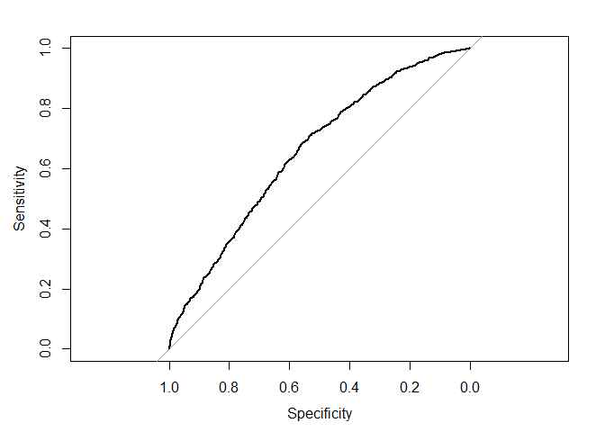<!-- -->

```
## 
## Call:
## roc.default(response = test_set$loan_status, predictor = pred_4_remove_amnt)
## 
## Data: pred_4_remove_amnt in 8660 controls (test_set$loan_status 0) < 1037 cases (test_set$loan_status 1).
## Area under the curve: 0.6548
```

## Predictions with the Best Model


```r
#Obtain the cutoff for acceptance rate 80%
cutoff_remove_amnt <- quantile(pred_4_remove_amnt, 0.8)

#Obtain the binary predictions.
bin_pred_remove_amnt <- ifelse(pred_4_remove_amnt> cutoff_remove_amnt,1,0)

#Obtain the actual default status for the accepted loans
accepted_status_remove_amnt <- cbind(pred_4_remove_amnt, bin_pred_remove_amnt)

#Check the structure of our new matrix
str(accepted_status_remove_amnt)
```

```
##  num [1:9697, 1:2] 0.1198 0.193 0.1521 0.0658 0.2162 ...
##  - attr(*, "dimnames")=List of 2
##   ..$ : chr [1:9697] "1" "2" "3" "4" ...
##   ..$ : chr [1:2] "pred_4_remove_amnt" "bin_pred_remove_amnt"
```


```r
#Transform it into a dataframe for merging
accepted_status_remove_amnt <- data.frame(accepted_status_remove_amnt)

#Create a final dataframe which combines the predictions and actual test set
results_df <- cbind(test_set,accepted_status_remove_amnt)
table(results_df$loan_status,results_df$bin_pred_remove_amnt)
```

```
##    
##        0    1
##   0 7068 1592
##   1  690  347
```
